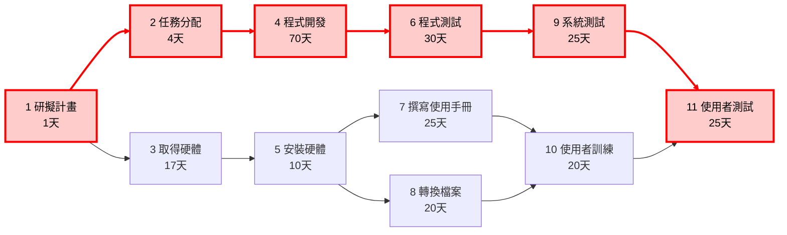
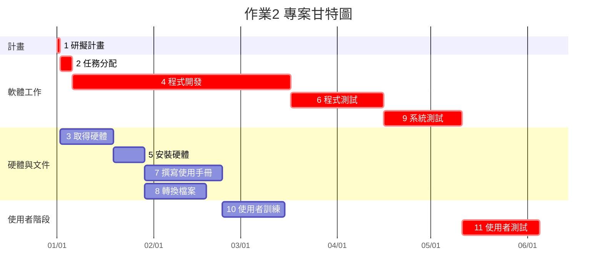

# 個人作業2：PERT/CPM、甘特圖與關鍵路徑

## 一、任務資料

| 任務 | 說明 | 需時（天） | 前置任務 |
|---|---|---:|---|
| 1 | 研擬計畫 | 1 | - |
| 2 | 任務分配 | 4 | 1 |
| 3 | 取得硬體 | 17 | 1 |
| 4 | 程式開發 | 70 | 2 |
| 5 | 安裝硬體 | 10 | 3 |
| 6 | 程式測試 | 30 | 4 |
| 7 | 撰寫使用手冊 | 25 | 5 |
| 8 | 轉換檔案 | 20 | 5 |
| 9 | 系統測試 | 25 | 6 |
| 10 | 使用者訓練 | 20 | 7、8 |
| 11 | 使用者測試 | 25 | 9、10 |

---

## 二、開始時間與結束時間

假設專案從第 0 天開始。

| 任務 | 說明 | 開始時間 | 結束時間 |
|---|---|---:|---:|
| 1 | 研擬計畫 | 0 | 1 |
| 2 | 任務分配 | 1 | 5 |
| 3 | 取得硬體 | 1 | 18 |
| 4 | 程式開發 | 5 | 75 |
| 5 | 安裝硬體 | 18 | 28 |
| 6 | 程式測試 | 75 | 105 |
| 7 | 撰寫使用手冊 | 28 | 53 |
| 8 | 轉換檔案 | 28 | 48 |
| 9 | 系統測試 | 105 | 130 |
| 10 | 使用者訓練 | 53 | 73 |
| 11 | 使用者測試 | 130 | 155 |

因此整個專案最短需要 **155 天**。

---

## 三、PERT / CPM 圖

PERT / CPM 圖中，**紅色節點與紅色連線**代表本專案的關鍵路徑：

**1 → 2 → 4 → 6 → 9 → 11**

---

## 四、甘特圖

以下使用 Mermaid 甘特圖表示各項工作的執行時間，其中 `crit` 表示關鍵路徑上的任務。

> 任務 10 的前置任務為 7、8，因此必須等任務 7 和任務 8 都完成後才能開始。
>
> 任務 11 的前置任務為 9、10，因此必須等任務 9 和任務 10 都完成後才能開始。
>
> Mermaid 甘特圖對多個前置任務的表示較有限，因此實際開始與結束時間以 CPM 計算結果為準。
>
> 由於題目未提供實際專案開始日期，因此甘特圖以 **2026/01/01** 作為假設開始日期，主要用於呈現各任務的先後關係與工期。

---

## 五、關鍵路徑

透過 CPM 計算各任務的最早開始時間（ES）、最早完成時間（EF）、最晚開始時間（LS）、最晚完成時間（LF）及浮時（Slack）。

浮時為 0 的任務即為關鍵任務。

| 任務 | ES | EF | LS | LF | 浮時 |
|---|---:|---:|---:|---:|---:|
| 1 | 0 | 1 | 0 | 1 | 0 |
| 2 | 1 | 5 | 1 | 5 | 0 |
| 3 | 1 | 18 | 51 | 68 | 50 |
| 4 | 5 | 75 | 5 | 75 | 0 |
| 5 | 18 | 28 | 75 | 85 | 57 |
| 6 | 75 | 105 | 75 | 105 | 0 |
| 7 | 28 | 53 | 85 | 110 | 57 |
| 8 | 28 | 48 | 90 | 110 | 62 |
| 9 | 105 | 130 | 105 | 130 | 0 |
| 10 | 53 | 73 | 110 | 130 | 57 |
| 11 | 130 | 155 | 130 | 155 | 0 |

因此，本專案的關鍵路徑為：

**1 → 2 → 4 → 6 → 9 → 11**

即：

**研擬計畫 → 任務分配 → 程式開發 → 程式測試 → 系統測試 → 使用者測試**

關鍵路徑總工期：

**1 + 4 + 70 + 30 + 25 + 25 = 155 天**

因此，本專案最短完成時間為 **155 天**。
